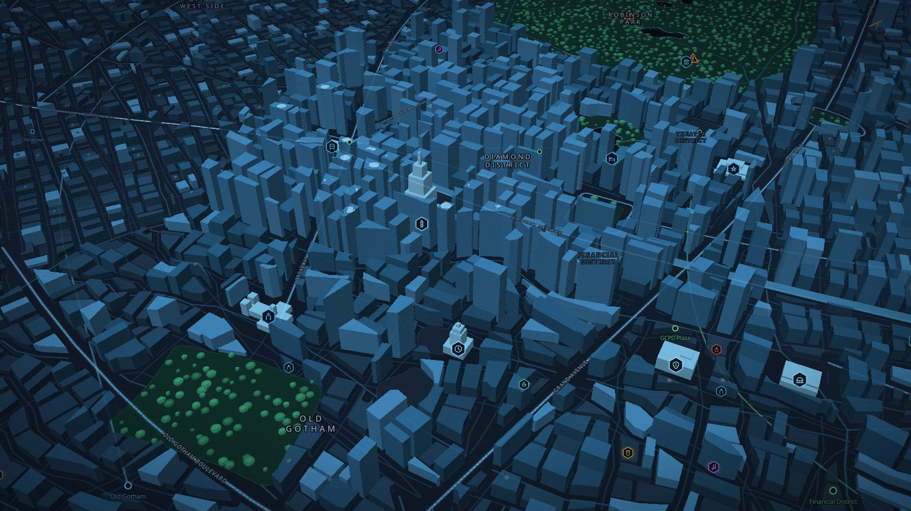
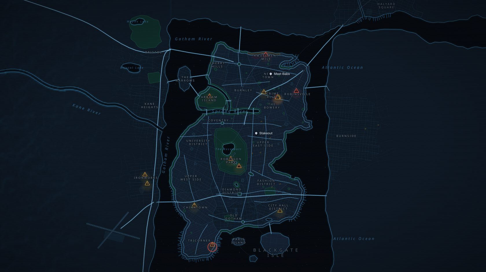
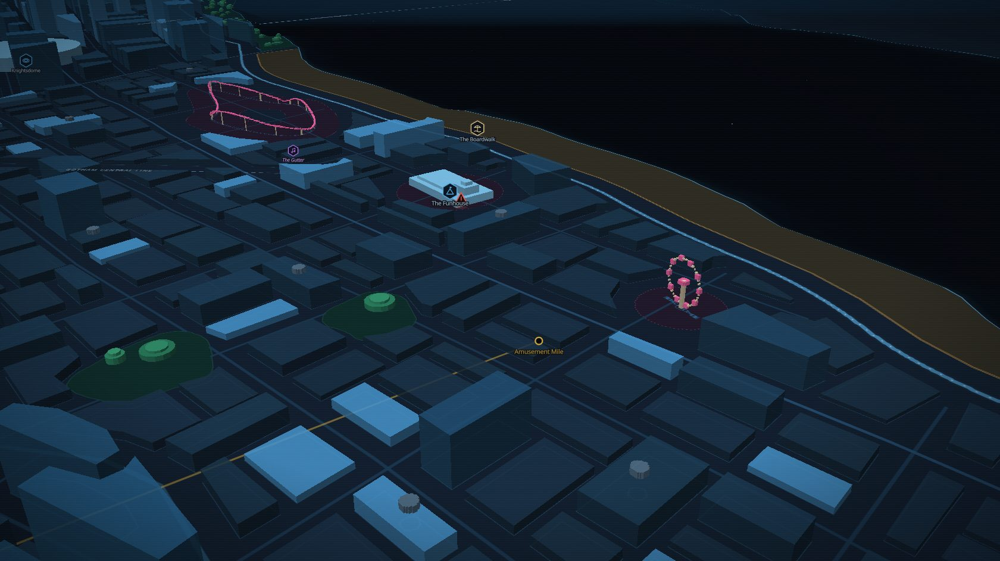
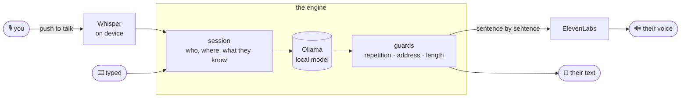

<div align="center">

# 🦇 WayneTech Console

**Gotham, running on your Mac.**
Call Alfred. Text Dick. Get left on read by Jason. Watch the city move on a live holographic map, and work the cases off the police scanner.




</div>

You're Bruce Wayne. The console is your phone: nine people who each have their own voice, memory, schedule and opinions of you, and a city that carries on whether or not you're watching. Everything except the voices runs on your machine: the model thinks locally through [Ollama](https://ollama.com), and [ElevenLabs](https://elevenlabs.io) does the speaking.

> [!NOTE]
> This is a hobby project and an ongoing experiment in making characters feel like people rather than chatbots. Nothing they say is scripted: their days, texts, moods, the dispatches on the scanner and how a case ends are all generated, inside rules that keep them consistent.

<details>
<summary><b>📖 Contents</b></summary>

- [Meet the cast](#-meet-the-cast)
- [What it does](#-what-it-does)
- [Gotham, the map](#%EF%B8%8F-gotham-the-map)
- [Things to try](#-things-to-try)
- [Setup](#-setup)
- [Keys](#%EF%B8%8F-keys)
- [How it works](#-how-it-works)
- [Making it yours](#-making-it-yours)
- [Evaluation](#-evaluation)
- [Development](#%EF%B8%8F-development)
- [Notes and limitations](#-notes-and-limitations)

</details>

---

## 🎭 Meet the cast

| | Contact | Who they are to you | On the phone |
|---|---|---|---|
| 🎩 | **Alfred Pennyworth** | Raised you. Runs the Manor, and the case board. | "Master Bruce." Dry, brief, warm underneath. Sees everyone's location, like you. |
| 🤸 | **Dick Grayson**, *Nightwing* | The first Robin. Blüdhaven's now. | Lowercase bursts, emoji, the one who checks in after a bad call. |
| 🔍 | **Tim Drake**, *Robin* | The detective. | Methodical, dry, won't let you spiral. |
| 💻 | **Barbara Gordon**, *Batgirl / Oracle* | A peer who commands. | Exact punctuation. Watches the scanner and the map. |
| 🩰 | **Cassandra Cain**, *Orphan* | Reads bodies, not words. | Says little. Sees everything. |
| 🔴 | **Jason Todd**, *Red Hood* | Came back angry. | "k". Doesn't share where he is. |
| 🦅 | **Randy Wayne**, *Batwing* | Your son, estranged, flying alone. | Leaves you on read more often than not. |
| 🏢 | **Lucius Fox** | Runs Wayne Enterprises; builds your toys. | "Mr. Wayne." A measured sentence, a firm ethical line. |
| 🐈‍⬛ | **Selina Kyle**, *Catwoman* | Randy's mother. | Her own woman, on her own schedule. |

Each one is a JSON profile in [`wayne/contacts/profiles/`](wayne/contacts/profiles/), and adding a tenth is a file, not a code change (see [Making it yours](#-making-it-yours)).

## ✨ What it does

<table>
<tr><td width="50%" valign="top">

### 📞 Calls
- **Hold to talk** (the button or <kbd>Space</kbd>), or type. Talk over them and they stop.
- **Speech starts in about half a second.** Sentences are voiced as the model writes them, and the words appear in time with the voice.
- **A ring that means something.** It covers the model warming up; busy people decline, sleeping ones ring out, and they call you back.
- **Group calls**, you plus four, each with a visualiser of their own. While you're ringing someone in, the others talk among themselves (*"why are you ringing him?"*). Late joiners get asked where they've been, people now and then talk over each other and sort it out, and you can leave from the end-call button.

</td><td width="50%" valign="top">

### 💬 Texts and group chats
- **Read receipts at their pace, both ways.** Seconds if their phone's in hand, hours if they're on patrol, never if they're Randy in a mood. Typing dots, then one message or three in a row, in their own style. They can see when you've read theirs, too.
- **Left on read, chased, or ghosted**, depending on who it is — and whether you read it or never opened it.
- **Moods in waves.** Phones ride the city's rhythm (the commute, the evening scroll, the dead small hours) and spells of their own: a flowing hour, then a dry afternoon of one-word answers.
- **Replies that quote.** Reply to one message in particular; they quote-reply too, to you or to each other.
- **Group chats** that live without you. They answer each other, go quiet when everyone's asleep, chase a question nobody's read, and take a private aside to your DMs.
- **@tags that ping.** `@Tim`, `@everyone`, and `@Bruce` lights up *your* screen with its own tone and badge.
- **Emoji and reactions.** A picker in the composer, reactions from a hover button. Reacting is a habit of theirs, not a reflex: Alfred almost never, Cass more than she writes, and a 👍 can be the whole answer.

</td></tr>
<tr><td valign="top">

### 🗓️ Their lives
- **A day of their own**, planned each morning by the model: sleep, work, patrol, errands, a film they wanted to catch.
- **Where they are** comes from what they're doing, and agrees for everyone. If Barbara's patrolling with Cass, they're in the same place on the map, on the hover card and in what they say. When it changes, they **travel** there by road, over the bridges, as long as it takes.
- **Days of their own.** Nobody patrols at noon unless you ask: Lucius is at the office, Barbara at the lab, Randy at the hangar.
- **They get in touch first.** They report back when they said they would, check in when a call worried them, close a case and tell you how it went, or text because something reminded them of you.
- **Hobbies that stay current.** What they follow is searched daily, so three months from now they've seen the new season too.

</td><td valign="top">

### 🚨 The city
- **A police scanner** with a steady stream of reports drawn from each district's own trouble: Crime Alley far more than the Upper East Side, and three times busier at night. GCPD dispatches are written by the model, and some of them are as grim as Gotham gets.
- **Cases.** Put someone on a report from the map, or just tell them in conversation. Awake, they take it about as readily as they take orders (Dick nearly always, Randy rarely); asleep, they get your text when they wake. They travel there, talk about it, and close it when they say it's handled. Now and then a patrol takes a call on its own.
- **Hearsay.** What one of them hears may reach another, with who said it.
- **Secrets that stay secret.** Every fact about you is tagged with who knows it, so Lucius never learns who's under the Batwing mask.

</td></tr>
</table>

## 🗺️ Gotham, the map

Press <kbd>M</kbd>. Gotham is drawn from [`wayne/engine/gotham.json`](wayne/engine/gotham.json) by [`scripts/build_map.py`](scripts/build_map.py) and rendered with [MapLibre GL](https://maplibre.org) in the console's own palette, as a hologram of the city you can tilt into 3D.

<div align="center">

</div>

<table>
<tr>
<td width="50%"></td>
<td width="50%"></td>
</tr>
<tr>
<td><sub><b>Amusement Mile.</b> Gotham's one beach, the boardwalk, the big wheel and the coaster, built in the air so they stand up in 3D, and the Funhouse, which is never quite empty.</sub></td>
<td><sub><b>Blüdhaven</b>, across the water: its harbour, its towers, and the sprawl thinning out into the mainland.</sub></td>
</tr>
</table>

<details>
<summary><b>Everything that's on it</b></summary>

- **The people.** Everyone who shares their location appears as their portrait, moving along the roads when they're on their way somewhere, with the roads they took tonight. Click one to follow them. The ones who don't share show where you last knew them to be.
- **Over a hundred and seventy places**, from canon where there is one (Gotham Academy, Arkham Mansion, Kane Industries, the Monarch Playing Card Company, Daggett Industries, Fort Dumas), each with a bio and **a note from Bruce** about it ("Every time we clear it out, someone moves back in."). Every district has a character of its own; click one to see it and what's there. Name a place to anyone and they know it.
- **Districts and how safe they are.** Turn on the safety layer for a heat map of the city's trouble.
- **The scanner** on the map: pulsing warnings, severity from amber to red, the dispatch on hover, and who's on it. Assign someone straight from the card.
- **The city itself:**
  - roads in one real network (the Skyway on its piers, roundabouts, a star junction), every river crossed by a bridge;
  - landmarks built as themselves: the university's quads and domed library, Ace's vats and catwalks, a four-chimneyed power station, the Knightsdome, a whole airport with gates, taxiways, lights, car parks and hangars;
  - subway, rail, ferries and shipping channels; container terminals, cranes over building sites, water towers and helipads;
  - pitches, ball fields, courts, a running track, a country club, a racecourse, Slaughter Swamp;
  - clubs, bars, diners, cafés, gyms, cinemas, hotels, shops, churches, fire stations and schools, each named;
  - tree-lined suburbs, lit windows, and terrain you can see in 3D — with nothing standing on a road.
- **Things moving, on timetables that follow the hour:** subway trains under the streets and trains on their lines, ferries between piers, ships coming in with their tugs, planes landing and taking off, police, news, medevac and tour helicopters, sailboats off the marina, the lighthouse turning, traffic on the highways.
- **At night**, the Bat-Signal over GCPD.
- **Search** (<kbd>/</kbd>) for people, places, pins and reports. Use **Layers** to toggle what's drawn, and right-click to drop **pins** of your own.

The map's data is generated, not hand-drawn. To change Gotham, edit `gotham.json` and rebuild (see [Development](#%EF%B8%8F-development)).

</details>

<div align="center">

</div>

## 🎯 Things to try

Tick them off as you go.

- [ ] Ask Alfred where everyone is tonight.
- [ ] Text Dick something worrying, then don't reply. See who checks in later.
- [ ] Make a group chat with Dick and Randy, and ask Dick in your DM to say something in it.
- [ ] `@everyone` the group at 3am.
- [ ] Put Tim on the worst report on the scanner, then call him and ask how it's going.
- [ ] Ring Cass and add Jason to the call while it's ringing.
- [ ] React ❓ to one of Barbara's texts.
- [ ] Ask Lucius what he's watching this week.
- [ ] Open the map at night and find the Bat-Signal.
- [ ] Ask Dick to come to Wayne Tower, then watch him drive in from Blüdhaven.
- [ ] Ask anyone what's in Burnside.
- [ ] Take the 3D view down to Amusement Mile.

## 🚀 Setup

**You'll need:**
- a Mac with Apple Silicon (24 GB for the default model, 16 GB for the small one);
- Python 3.11 or 3.12;
- [Ollama](https://ollama.com);
- an [ElevenLabs](https://elevenlabs.io) API key;
- a microphone.

```bash
git clone https://github.com/<your-username>/wayne-console.git
cd wayne-console
python3.11 -m venv venv && source venv/bin/activate
pip install -r requirements.txt

ollama pull gemma4:26b-a4b-it-qat     # or gemma4:e4b on a 16 GB Mac
cp .env.example .env                  # add your ElevenLabs key and voice IDs
python run.py                         # → http://127.0.0.1:8420   (passcode: zorro)
```

> [!IMPORTANT]
> **Use Python 3.11 or 3.12, not 3.13+.** `tokenizers`, `ctranslate2` and `mlx-whisper` ship wheels only for those versions, and on a newer interpreter pip tries to build them from source and fails.

> [!TIP]
> **Make it an app:** `./scripts/make_app.command` builds **WayneTech Console.app**, with its own Dock icon and a window with no browser chrome. It starts Ollama and the server for you. It's a launcher that points at this folder, so code changes take effect when you reopen it; you only rebuild it if you move the project.

<details>
<summary><b>⚙️ All the settings (<code>.env</code>)</b></summary>

| Variable | | What it does |
|---|---|---|
| `ELEVENLABS_API_KEY` | **required** | Your ElevenLabs key. Without it, everyone still works, in text. |
| `ALFRED_VOICE_ID`, `NIGHTWING_VOICE_ID`, … | per contact | A voice from your ElevenLabs library. A contact without one works in text. |
| `WAYNE_OPERATOR` | `bruce` | Who you play: an operator profile id or path (see [Making it yours](#-making-it-yours)). |
| `ALFRED_OLLAMA_MODEL` | `gemma4:26b-a4b-it-qat` | The model everyone shares. |
| `WAYNE_PASSCODE` | `zorro` | The lock screen's passcode. Theatre, not security. |
| `WAYNE_WEB_PORT` | `8420` | The console's port. It only listens on `127.0.0.1`. |
| `WAYNE_DATA_DIR` | `data/` | Where memory lives. Point it at a scratch folder to experiment. |
| `WAYNE_MEMORY_KEY` | — | Encrypts memory at rest. `python run.py --new-key` prints one. Lose it and the memory is unreadable. |
| `WAYNE_INITIATIVE_PER_DAY` | `12` | Most unprompted texts a day, across everyone. `0` turns them off (promises are still kept). |
| `WAYNE_QUIET_HOURS` | `1-8` | Hours when nobody texts out of the blue. |
| `WAYNE_HISTORY_WORDS` | `260` | Conversation words sent to the model: the main latency dial. |
| `WAYNE_CONTEXT_WINDOW` | `8192` | Model context in tokens. |
| `WAYNE_TTS_MODEL` | `eleven_v4_turbo` | `eleven_v4` is more expressive and about 0.5s slower to start. |
| `WAYNE_WHISPER_HINTS` | — | Comma-separated names to help speech recognition. |
| `WAYNE_LOCATION`, `WAYNE_NEWS_FEED`, `WAYNE_CALENDAR` | — | Opt-in feeds: weather, headlines, and (for Alfred) your macOS calendar. |
| `BRAVE_API_KEY` | — | A real search API. DuckDuckGo is used without one. |
| `WAYNE_PTT_KEY` | `Key.cmd_r` | Push-to-talk key for the terminal frontend (`--cli`). |

</details>

<details>
<summary><b>🧠 Running the model well on 24 GB</b></summary>

Gemma's sliding-window attention makes Ollama keep large context checkpoints for every parallel slot. With the defaults, the model server grew to 25 GB and everything crawled in swap. Run Ollama with:

```bash
launchctl setenv OLLAMA_NUM_PARALLEL 1
launchctl setenv OLLAMA_FLASH_ATTENTION 1
launchctl setenv OLLAMA_KV_CACHE_TYPE q8_0
```

The app built by `make_app.command` sets these for you. Measured on an M4 Pro, the first sentence arrives in about 0.84s with `gemma4:26b-a4b-it-qat` (the default, and the best character by a distance) and 0.66s with `gemma4:e4b`. Run `venv/bin/python scripts/bench_model.py <model>` to measure your own.

If you try a reasoning model (qwen3, deepseek-r1, gpt-oss), set `"think": false` in the profile, or it spends its whole budget thinking and never speaks.

</details>

## ⌨️ Keys

| | |
|---|---|
| <kbd>Space</kbd> (hold) | Talk |
| <kbd>Enter</kbd> | Send what you typed |
| <kbd>Esc</kbd> | Stop playback · close the map · close a picker |
| <kbd>M</kbd> | Open the map |
| <kbd>/</kbd> | Search the map |
| <kbd>@</kbd> | Tag someone (in a group, `@everyone` too) |
| Double-click a message | React |
| Right-click the map | Drop a pin |

## 🔧 How it works



A conversation is one engine for calls, texts and the terminal alike. It never prints or plays anything: it yields events, and each frontend decides how to show them. Around it:

| | |
|---|---|
| [`presence.py`](wayne/engine/presence.py) | What each of them is doing, where, and with whom. One state drives the status dot, how fast they read, whether they answer, and what they're in the middle of when you call. |
| [`initiative.py`](wayne/engine/initiative.py) | The pass after every conversation: what they're off to do, promises to keep, whether they're worried about you, whether a case is closed. Also their morning plans and status lines. |
| [`places.py`](wayne/engine/places.py) · [`gotham.json`](wayne/engine/gotham.json) | The gazetteer: where "the docks" or "home" actually is, beats to patrol, the shape of the city. |
| [`incidents.py`](wayne/engine/incidents.py) · [`cases.py`](wayne/engine/cases.py) | The scanner (the same moment always gives the same reports, so the map, the patrols and the people on comms agree) and the cases taken from it. |
| [`groupchat.py`](wayne/engine/groupchat.py) · [`party.py`](wayne/engine/party.py) | Who answers in a group and when it goes quiet; who speaks next on a group call. |
| [`culture.py`](wayne/engine/culture.py) · [`grapevine.py`](wayne/engine/grapevine.py) | What they've been watching and following; what one heard from another. |
| [`guards.py`](wayne/engine/guards.py) | The failures that break the illusion, caught in code: echoing you, repeating themselves, a forbidden form of address, a monologue. |

<details>
<summary><b>A few of the details that make it feel real</b></summary>

- **The ring covers the load.** A call's greeting is generated and voiced while it rings, so they speak the moment they pick up.
- **They know they're on a link.** No offering you tea, no telling you to sit down. They can't see you.
- **They won't invent your life.** Anything about your day has to have been said by you or remembered; their own afternoon is theirs to make up.
- **Whisper's confident mistakes are caught.** Low-confidence audio is flagged to the contact, who asks rather than assumes.
- **The voice can't hear itself.** Echo cancellation, a higher threshold while a reply plays, and a final check that discards a transcript matching what was just said aloud.
- **Memory knows when.** Facts are dated and the conversation timestamped, so "it's been a while" means something.
- **If the voice fails**, the link degrades and they carry on in text. No stack traces.

</details>

<details>
<summary><b>🗂️ Project layout</b></summary>

```
wayne-console/
├── run.py                       # web console (default), --cli, --list, --new-key
├── wayne/
│   ├── contacts/profiles/*.json # the cast
│   ├── operators/bruce.json     # who you play, and who knows what about you
│   ├── engine/                  # session, presence, initiative, party, groupchat,
│   │                            # places, incidents, cases, culture, grapevine,
│   │                            # guards, prompting, search, world
│   ├── memory/                  # history, texts, groups, vault, encrypted store
│   ├── audio/                   # Whisper in, ElevenLabs out
│   └── frontends/               # web (FastAPI + WebSocket), groupchats, cli
├── web/                         # the console: no build step, no node
│   ├── js/                      # app, gothammap, audio, mic, tones, visualizer…
│   ├── map/                     # built city, buildings, trees, terrain tiles, fonts
│   └── vendor/maplibre/         # MapLibre GL (BSD-3)
├── scripts/                     # build_map, evaluate, bench_model, make_app
├── eval/                        # rubric and scenarios
└── tests/
```

</details>

## 🧬 Making it yours

**Be someone else.** Who you are lives in an operator profile, [`wayne/operators/bruce.json`](wayne/operators/bruce.json): your story, what each contact calls you ("Master Bruce", "Mr. Wayne", "old man"), and the world, with every fact tagged by who knows it. Copy it somewhere private, rewrite it, and point `WAYNE_OPERATOR` at it. Every contact follows.

**Add someone.** Drop a JSON file in `wayne/contacts/profiles/`, and add a portrait at `web/portraits/<id>.png` if you like. Portraits are gitignored, since they're usually personal or someone else's copyright.

<details>
<summary><b>The profile fields that matter</b></summary>

| Field | |
|---|---|
| `system` | The character, as paragraphs: who they are, their temperament, what you are to them. Written as a person, not a list of rules. |
| `primer`, `texting_primer` | Worked examples, sent as a labelled script, never as turns (a model can't tell a sample turn from a real one). |
| `speech_length` | How long they talk on a call, as a spread each turn is drawn from. |
| `texting`, `texting_style`, `texting_pace` | How they write, the habits enforced in code (lowercase, dropped full stops, bursts, emoji), and how fast they read and type. |
| `routine`, `initiative` | Their fallback day, and how often they reach out, chase, answer, call back. |
| `home`, `beat`, `shares_location`, `shares_status` | Where they live, where they patrol, and what you get to see. |
| `sees_whereabouts`, `can_search`, `sees_calendar` | Alfred and Barbara see the tracker and the scanner; some can look things up at a screen. |
| `interests` | Pastimes, games, what they watch and read, their takes, and what they `follows` (searched daily to keep them current). |
| `forbidden_address` | Enforced in code, because one "lad" undoes a lot of careful prompting. |

</details>

## 📏 Evaluation

Changes to a character, the prompt or the engine are measured rather than eyeballed. [`eval/rubric.md`](eval/rubric.md) is the marking scheme and [`eval/scenarios/`](eval/scenarios) holds the situations: lives, culture, relationships, repetition, forms of address, and one file per contact.

```bash
venv/bin/python scripts/evaluate.py --cast --save before      # the whole cast
venv/bin/python scripts/evaluate.py --cast --compare before   # after a change: head to head, with a sign test
venv/bin/python scripts/evaluate.py --contact orphan --tier full
```

Every scenario runs through the real engine from an empty history, with nothing written to memory. It's marked by automatic checks and by a judge model that knows how each character talks. Results go to `eval/results/` (gitignored). Run it when nobody's using the console, because two processes on one model on 24 GB slow both to a crawl.

## 🛠️ Development

```bash
venv/bin/python -m pytest -q          # the suite
venv/bin/python -m ruff check .       # lint

# Rebuild Gotham after editing wayne/engine/gotham.json:
venv/bin/pip install shapely          # build-time only; the console never imports it
venv/bin/python scripts/build_map.py  # → web/map/: city, buildings, trees, terrain
```

Test with a scratch `WAYNE_DATA_DIR` so your real memory stays out of it. Front-end changes show on a reload (asset URLs are stamped with a version that follows the files), and Python changes on a restart.

## 📝 Notes and limitations

- **The lock screen is not access control.** It's checked in the page, and the passcode sits in plain text in `.env`. It exists because a console should feel like one.
- **Local-first, not local-only.** The model and speech recognition run on your Mac; the reply text goes to ElevenLabs to be voiced.
- **Memory encryption is opt-in and key-adjacent.** The key lives in `.env` beside the data: good against casual reading and backups, not against someone who has that file.
- **macOS only** as written (`afplay`, and `pynput` for the terminal's hotkey).
- **Wiping memory:** stop the server and delete `data/` (or one contact's folder under it). Saying "protocol zero" to a contact wipes theirs.

## License

[MIT](LICENSE). MapLibre GL is BSD-3 ([`web/vendor/maplibre/LICENSE.txt`](web/vendor/maplibre/LICENSE.txt)); Noto Sans is under the SIL Open Font License ([`web/map/fonts/OFL.txt`](web/map/fonts/OFL.txt)). Batman and everyone in Gotham belong to DC; this is a fan project, not affiliated with or endorsed by them.
